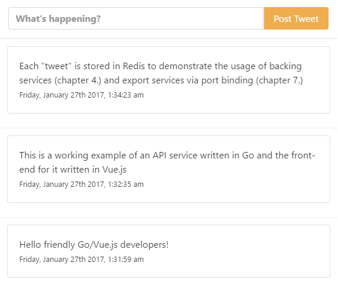

The code here demonstrates a few principles of modern API/Go/Web development:

1. APIs are provided by Go,
2. Go does the port binding (web server),
3. Front-end is done in Vue.js (fully static files),
4. APP uses redis (attached resources),
5. Config comes from the environment

This is a sample included in the book [12 Factor Applications with Docker and Go](https://leanpub.com/12fa-docker-golang).

The whole thing is just cool, small, nice, sexy, sweet. As the author, I am biased.

Runs in docker with `./run`.

